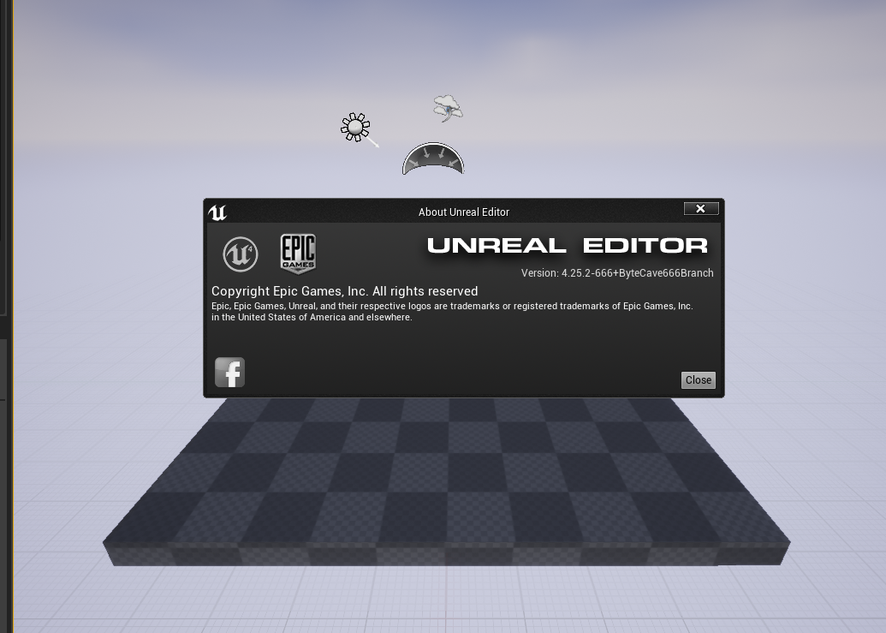
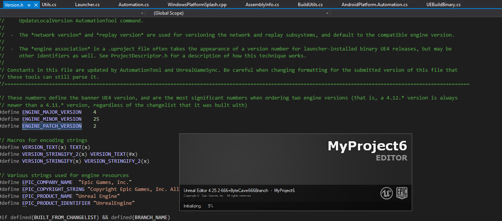

# Sections
[UE4 Commands](#UE4-Commands)

[UE4 new engine version without P4](#UE4-noP4)

[UE4 new engine with P4, Epic's way](#UE4-P4)

[UE4 Common Pitfalls when creating a new version](#Common-Pitfalls)

[UE4 Binary Distro](#UE4-Binary-Distro)

[UE4 Build System](#UE4-Build-System)

[Uncooked Builds Execution](#Uncooked-Builds-Execution)

[UE4 Blueprints](#UE4-Blueprint)


# UE4-noP4
Create a new engine version

Build.version is the entry point to change the engine version.

AutomationToolLauncher is invoked with the BatchFiles included with the engine distro,
verify listing all the command line options 
```
Binaries\DotNET>.. \ .. \Build\BatchFiles\RunUAT.bat -list 
```

Generally, to generate a new engine version, it must be P4 connected
```
Binaries\DotNET>.. \ .. \Build\BatchFiles\RunUAT.bat UpdateLocalVersion
```

AutomationToolLauncher includes a NoP4 option, not implemented by Epic
```
UpdateLocalVersion -Verbose -NoP4
```

We provide two methods to avoid using P4 and support the -NoP4 command line option.


## First method (debugging hack)
* Automation.cs if (CommandUtils.P4Enabled) to false change it during runtime
* One line comment in UE4Build.cs 
```
CommandUtils.P4.Sync(String.Format("-f \"{0}@{1}\"", BuildVersionFile, ChangelistNumber), false, false);
```


## Second method (completing code)
1. Automation.cs implements NoP4 support
```
// Enable or disable P4 support
if (!GlobalCommandLine.NoP4)
{
	CommandUtils.InitP4Support(CommandsToExecute, ScriptCompiler.Commands);
	if (CommandUtils.P4Enabled)
	{
		Log.TraceLog("Setting up Perforce environment.");
		CommandUtils.InitP4Environment();
		CommandUtils.InitDefaultP4Connection();
	}
}
```		
2. UE4Build.cs implements NoP4 support
```
public List<FileReference> UpdateVersionFiles(bool ActuallyUpdateVersionFiles = true, int? ChangelistNumberOverride = null, int? CompatibleChangelistNumberOverride = null, string Build = null, bool? IsPromotedOverride = null)
		{
			bool bIsLicenseeVersion = ParseParam("Licensee") || !FileReference.Exists(FileReference.Combine(CommandUtils.EngineDirectory, "Build", "NotForLicensees", "EpicInternal.txt"));
			bool bIsPromotedBuild = IsPromotedOverride.HasValue? IsPromotedOverride.Value : (ParseParamInt("Promoted", 1) != 0);
			bool bDoUpdateVersionFiles = ParseParam("NoP4") ? (false || ParseParam("Build")): CommandUtils.P4Enabled && ActuallyUpdateVersionFiles;		
			int ChangelistNumber = 0;
			if (bDoUpdateVersionFiles)
			{
				ChangelistNumber = ChangelistNumberOverride.HasValue? ChangelistNumberOverride.Value : CommandUtils.P4Env.Changelist;
			}
			int CompatibleChangelistNumber = 0;
			if(bDoUpdateVersionFiles)
			{
				CompatibleChangelistNumber = CompatibleChangelistNumberOverride.Value;
			}

			string Branch = OwnerCommand.ParseParamValue("Branch");
			if (String.IsNullOrEmpty(Branch))
			{
				Branch = ParseParam("NoP4") ? ParseParamValue("Branch") : (CommandUtils.P4Enabled ? CommandUtils.EscapePath(CommandUtils.P4Env.Branch) : "");
			}

			return StaticUpdateVersionFiles(ChangelistNumber, CompatibleChangelistNumber, Branch, Build, bIsLicenseeVersion, bIsPromotedBuild, bDoUpdateVersionFiles, ParseParam("NoP4"));
		}
```		
		
3. Implement NoP4 validation for all the occurrencies in UE4Build.cs
```
if(!NoP4 && CommandUtils.P4Enabled && ChangelistNumber > 0)
{
CommandUtils.P4.Sync(String.Format("-f \"{0}@{1}\"", BuildVersionFile, ChangelistNumber), false, false);
}
```	
4. Command line
 * Default use Build.version, BE AWARE it won't update MetaData.cs because it expects a P4 connection
```
.\..\Build\BatchFiles\RunUAT.bat UpdateLocalVersion -Verbose -NoP4
```

 * Override Build.version include cl, compatiblecl, Build, and Branch options
```
.\..\Build\BatchFiles\RunUAT.bat UpdateLocalVersion -Verbose -NoP4 -cl=666 -compatiblecl=666 -Build=ByteCave666 -Branch=ByteCave666Branch
```

5. Both methods Engine\Source\Programs\DotNETCommon\MetaData.cs should reflect the version changes

## Launching UE4 with newer Build.version file

>Creating makefile for UE4Editor (Build.version is newer)

Splash window is wrong! (again P4 validated)
to get full patch version displayed, WindowsPlatformSplash.cpp
```
const FText Version = FText::FromString( FEngineVersion::Current().ToString()); 
```




# UE3-P4

Alternatively, setting up P4 server is available for free
* Create a local server using P4Admin
* Run the deamon, p4d, where you created the local depot
* A single local user/workspace should be defined and files should be submitted there (there is no need to submit everything, one important file Build.version)
* Before running commandlet set the variable from cmd line
```
set uebp_PORT=6667
```
* Run commandlet
```
.\..\Build\BatchFiles\RunUAT.bat UpdateLocalVersion -Verbose -NoP4 -cl=666 -compatiblecl=666 -Build=ByteCave666 -Branch=ByteCave666Branch
```
* Make the splash screen changes if required, WindowsPlatformSplash.cpp, as explained above


# Common-Pitfalls
* mcrolib.dll , a .NET file, apparently related to the -compile option for RunUAT.bat
 * https://answers.unrealengine.com/questions/873535/automationtool-error-failed-to-delete-automationut.html
 * https://stackoverflow.com/questions/37960616/exception-thrown-system-exception-in-mscorlib-ni-dll-on-uwp-app-start 
 
# UE4-Binary-Distro
Deploy a custom engine version for artists or machines without VStudio

## Requirements
* Versioning Assets and Packages https://docs.unrealengine.com/en-US/ProgrammingAndScripting/ProgrammingWithCPP/UnrealArchitecture/VersioningAssetsAndPackages/index.html
* PDBCOPY.EXE https://developer.microsoft.com/en-us/windows/downloads/windows-10-sdk/
* Must have installed exactly .NET 4.5.0 (from VStudio)
 
## Pipeline
* AutomationTool BuildGraph -target="Make Installed Build Win64" -script=Engine/Build/ByteCaveBuildDistro.xml -clean
* UnrealVersionSelector.exe /fileassociations

# UE4-Commands
* Netprofile enable
* Netprofile disable
* Stat startfile
* Stat stopfile
* Stat Obj
* stat scenerendering drawcalls
* Slomo [float value]
* showflag.toggleparticles 0/1
* showflag.wireframe 0/1
* memreport -full
* stat D3D1RHI
* stat scenerendering
* stat engine
* toggleUI 1/0
* showdebug bones
* Net PktLoss=1
* Net PktOrder=0
* Net PktDup=0
* Net PktLag=75
* Net PktLagVariance=0
* p.netshowcorrections 1
* t.Max FPS 30
* ShowDebug Bones
* r.setres 2560x1440 (-setresx=2560 -setresy=1440)
* pxvis collision
* obj gc  forces garbage collector
* obj list class=material-textures list all materials textures


# UE4-Build-System
https://docs.unrealengine.com/latest/INT/Programming/UnrealBuildSystem/Configuration/index.html Unreal Build System


Disable IncrediBuild here!!!
UnrealEngine-4.16\Engine\Saved\UnrealBuildTool\BuildConfiguration.xml
     ```<BuildConfiguration>
         <bAllowXGE>false</bAllowXGE>
     </BuildConfiguration>```
Command line -noxge


# Uncooked-Builds-Execution
```
@ECHO OFF
SET UE4Path=C:\projects\UE_4.25\LocalBuilds\Engine\Windows\
SET Project=""C:\projects\MyProject\MyProject.uproject""
@START "CustomServer" /D %UE4Path%"Engine\Binaries\Win64\" UE4Editor.exe %Project% CustomMap?port=36004 -messaging -game -debug  -log
```
@ECHO OFF
* client
start "MyGameClient" /D "UE4\Engine\Binaries\Win64" /MAX UE4Editor.exe  "full_path\MyGame\MyGame.uproject" -game 127.0.0.1 -log -messaging
* editor
start "MyGameEditor" /D "UE4\Engine\Binaries\Win64" /MAX UE4Editor.exe  "full_path\MyGame\MyGame.uproject" Example_Map -log -messaging
* server
@echo off
start "MyGameserver" /D "UE4\Engine\Binaries\Win64" /MAX UE4Editor.exe  "full_path\MyGame\MyGame.uproject" Example_Map -log -messaging Example_Map -server -log -messaging

auto test
@echo off
SET IPServer=127.0.0.1

SET Server=TestSystemMap016?
REM MAP_PVPSetdressTest_005

* start "MyGameServer" /D "UE4\Engine\Binaries\Win64" /MAX UE4Editor.exe  "full_path\MyGame\MyGame.uproject" Example_Map?port=36004 -server -log -messaging -NOSTEAM -PORT=7810

## echo giving server some time to start

* ping /n 16 localhost >nul

## echo starting test client

* ping /n 7 localhost >nul


# UE4-Blueprint

## Runtime errors
I was using remote access on Maelgrim's computer while he was in the kitchen, and I fixed it!

Solution

Step 1 = open the BP that wont save

Step 2 = do a search for the word "transient"

Step 3 = click thru all the found references, and delete those nodes (make a backup before doing this)

Step 4 = do this till you can save!

Step 5 = recreate the nodes you deleted

